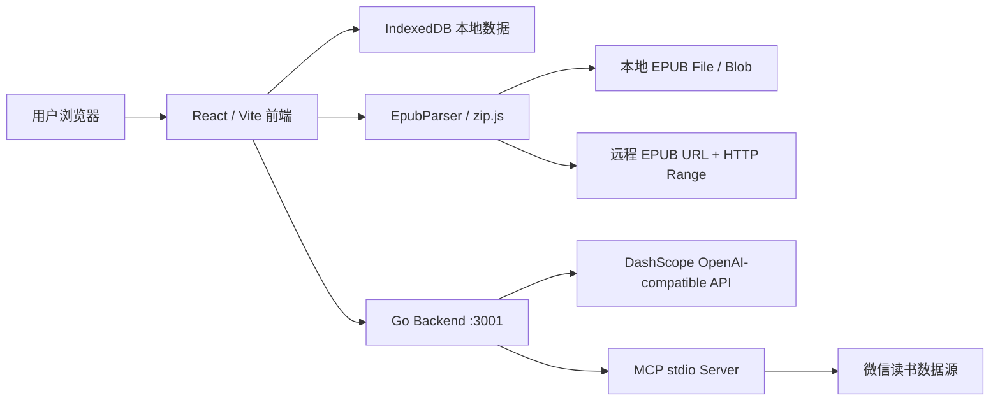
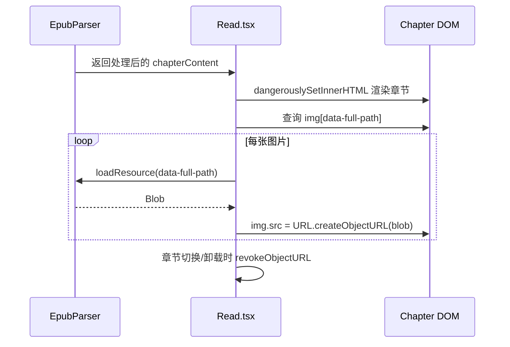
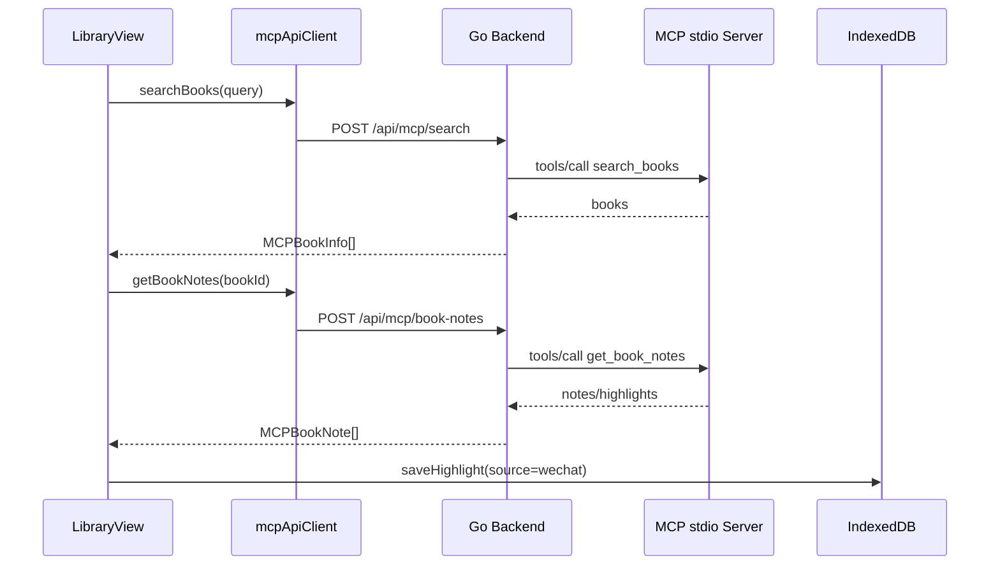
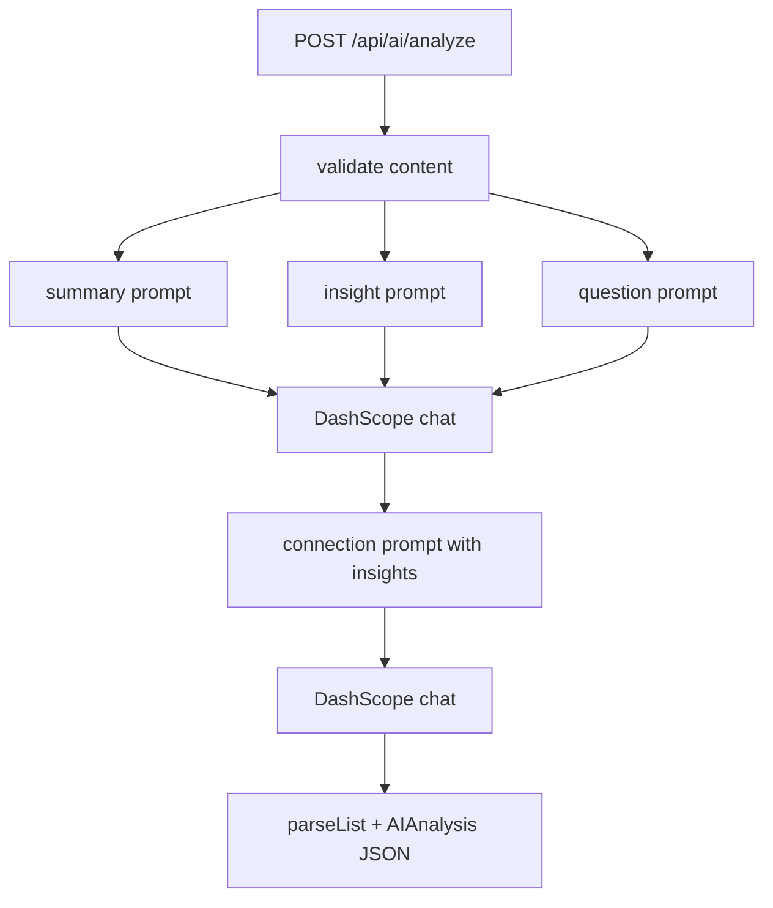
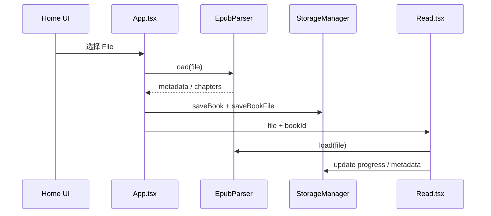
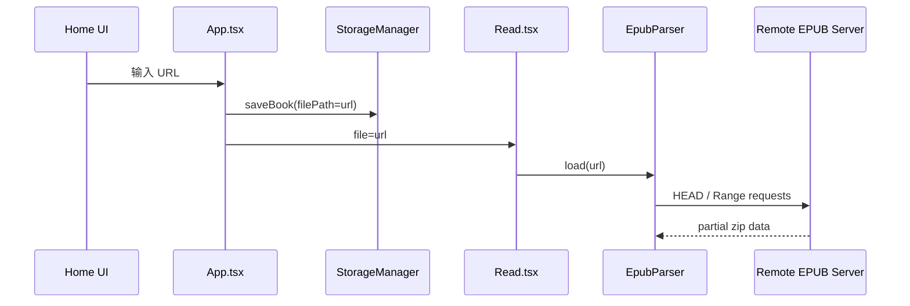
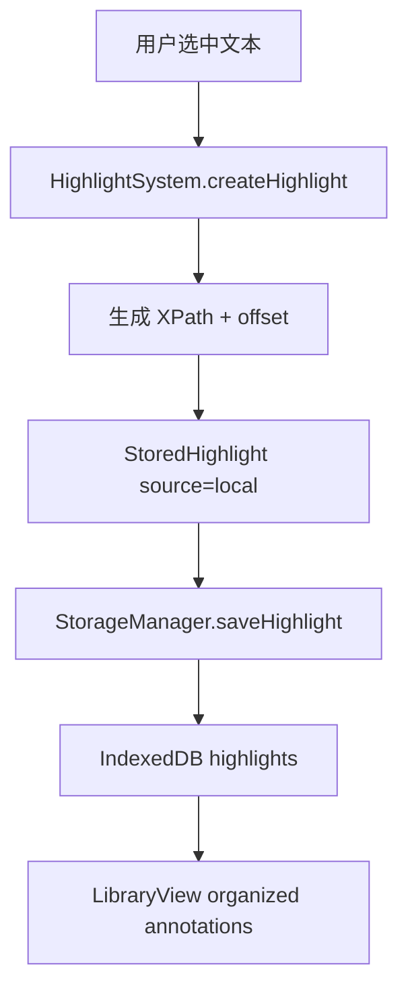
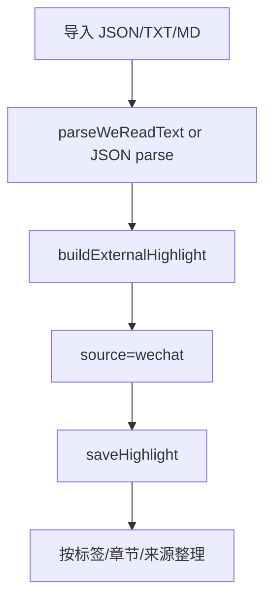
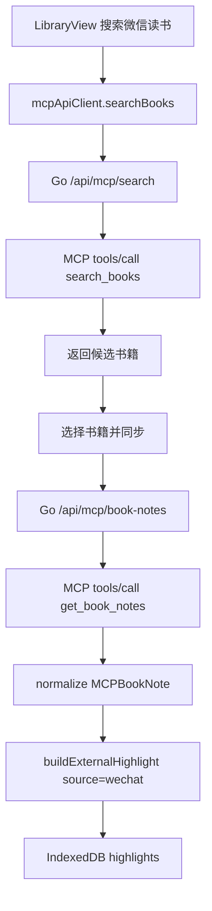

# EpubReader 技术方案

本文面向研发同学，说明 EpubReader 当前实现的系统边界、模块职责、数据模型、关键链路、后端迁移方案、接口契约和后续演进方向。

普通用户使用说明见 [README.md](../README.md)。

## 1. 背景与目标

EpubReader 的目标是提供一个本地优先的 EPUB 阅读与标注整理工具，同时打通微信读书划线和 AI 阅读分析能力。

当前核心诉求：

- 本地 EPUB 阅读、章节解析、图片资源加载、阅读进度恢复。
- 在线 EPUB 直接 URL 加载，并使用 HTTP Range 流式读取。
- 本地划线、笔记、标签、导出和图书馆整理。
- 微信读书划线导入和 MCP 同步。
- 本地 EpubReader 划线与微信读书划线统一整理。
- AI 内容分析和代码工具。
- 后端从 Nest/TypeScript 迁移为 Go 实现，保留前端 API 契约。

## 2. 总体架构



### 前端

- React 19 + TypeScript + Vite。
- 负责 EPUB 解析、阅读器交互、本地存储、图书馆整理、微信读书导入、AI/MCP API 调用。
- 数据默认保存到浏览器 IndexedDB。

### 后端

- Go 1.22。
- 使用标准库 `net/http` 暴露 REST API。
- 使用 DashScope OpenAI-compatible Chat Completions API。
- 使用标准库实现 MCP stdio JSON-RPC 客户端。
- 目标是轻量、可部署、保留现有前端 API 形状。

### 存储

- 主要业务数据在浏览器 IndexedDB。
- 后端当前不持久化业务数据，只作为 AI 和 MCP 桥接层。

## 3. 目录结构

```text
EpubReader/
├── src/
│   ├── App.tsx                         # 应用入口、视图切换、书籍打开逻辑
│   ├── api/
│   │   ├── aiClient.ts                 # AI REST 客户端
│   │   └── mcpApiClient.ts             # MCP REST 客户端
│   ├── parse/
│   │   └── parse.tsx                   # EPUB 解析、目录、章节、资源加载
│   ├── read/
│   │   ├── Read.tsx                    # 阅读器主界面
│   │   └── Read.css
│   ├── highlight/
│   │   ├── HighlightSystem.ts          # 划线定位、XPath 生成
│   │   └── VirtualHighlightRenderer.ts # 划线渲染
│   ├── storage/
│   │   └── StorageManager.ts           # IndexedDB 封装、整理、导出
│   └── library/
│       ├── LibraryView.tsx             # 图书馆、微信读书导入/MCP 同步、整理视图
│       └── LibraryView.css
├── backend/
│   ├── main.go                         # HTTP 服务、CORS、环境变量
│   ├── ai.go                           # DashScope AI 调用
│   ├── mcp.go                          # MCP stdio JSON-RPC 桥
│   ├── ai_test.go
│   ├── mcp_test.go
│   └── go.mod
└── docs/
    └── TECHNICAL_DESIGN.md
```

## 4. 前端模块设计

### 4.1 App 入口

文件：[src/App.tsx](../src/App.tsx)

职责：

- 初始化 `StorageManager`。
- 管理首页、图书馆、阅读器三种视图。
- 本地 EPUB 文件导入。
- 在线 EPUB URL 打开。
- 从图书馆恢复书籍。
- 恢复最近阅读会话。

关键设计：

- 本地书籍保存 `BookMetadata` 和 `BookFileRecord`。
- 在线书籍只保存 `BookMetadata.filePath = URL`，不再整包下载为 File。
- 打开书籍时通过 `getBookSource()` 获取 `File | string`：
  - 如果 IndexedDB 有本地文件，返回 `File`。
  - 如果 `filePath` 是 HTTP URL，返回 URL 字符串。

这样 `EpubParser.load(source)` 可以根据 source 类型走本地 File 或远程 Range。

### 4.2 EPUB 解析

文件：[src/parse/parse.tsx](../src/parse/parse.tsx)

职责：

- 加载本地 EPUB File。
- 加载远程 EPUB URL。
- 解析 `META-INF/container.xml`、OPF、spine、NCX、NAV。
- 提供章节列表、章节内容、封面、图片资源。

关键路径：

```ts
await epubParser.load(fileOrUrl)
await epubParser.loadChapter(chapterId)
await epubParser.loadResource(resourcePath)
await epubParser.getCoverImage()
```

本地文件：

```ts
new zip.BlobReader(file)
```

远程 URL：

```ts
new zip.HttpReader(url, {
  useRangeHeader: true,
  preventHeadRequest: false,
})
```

章节图片处理：

- `processChapterContent()` 扫描章节 HTML 内 `img[src]`。
- 对相对路径图片生成 `data-full-path`。
- 先用透明占位图替换 `src`，避免浏览器直接请求错误相对路径。
- 阅读器渲染后再用 `parser.loadResource()` 读取 Blob，并替换为 object URL。

路径规范化：

- 统一 `/`。
- 处理 `.` 和 `..`。
- 基于 OPF `basePath` 补齐资源路径。

### 4.3 阅读器

文件：[src/read/Read.tsx](../src/read/Read.tsx)

职责：

- 初始化 `EpubParser`。
- 渲染章节目录和正文。
- 加载 EPUB 封面并写回书籍元数据。
- 渲染和保存划线。
- AI 分析当前章节。
- AI 代码工具。
- 替换章节图片资源为 blob URL。

章节图片 hydrate 流程：



AI 功能：

- `aiClient.analyzeContent(content)`
- `aiClient.generateCode(description, language)`
- `aiClient.explainCode(code, language)`
- `aiClient.reviewCode(code, language)`

### 4.4 划线系统

文件：

- [src/highlight/HighlightSystem.ts](../src/highlight/HighlightSystem.ts)
- [src/highlight/VirtualHighlightRenderer.ts](../src/highlight/VirtualHighlightRenderer.ts)

职责：

- 从用户选区生成 `HighlightPosition`。
- 使用相对 XPath + offset 保存位置。
- 渲染已有划线。
- 支持多条笔记、标签和关系字段。

核心数据：

```ts
interface HighlightPosition {
  start: { xpath: string; offset: number }
  end: { xpath: string; offset: number }
  timestamp: number
}

interface Highlight {
  id: string
  position: HighlightPosition
  text: string
  color: string
  note?: string
  notes?: HighlightNote[]
  tags?: string[]
  createdAt: number
  updatedAt: number
}
```

微信读书导入的外部划线没有本地 EPUB XPath，因此当前使用不可渲染的占位 position，并作为整理数据参与图书馆视图，不参与正文精准高亮渲染。

### 4.5 本地存储

文件：[src/storage/StorageManager.ts](../src/storage/StorageManager.ts)

IndexedDB store：

- `books`
- `bookFiles`
- `highlights`
- `notes`

关键类型：

```ts
interface BookMetadata {
  id: string
  title: string
  author: string
  cover?: string
  filePath?: string
  progress: number
  lastReadAt: number
  currentChapterId?: string
  scrollTop?: number
  tags?: string[]
}

interface StoredHighlight extends Highlight {
  bookId: string
  chapterId: string
  chapterTitle?: string
  category?: string
  source?: "local" | "wechat"
}

interface BookNote {
  id: string
  bookId: string
  title: string
  content: string
  chapter?: string
  tags: string[]
  createdAt: number
  updatedAt: number
  source?: "local" | "wechat"
}
```

整理维度：

- byTag
- byChapter
- byDate
- bySource

导出：

- JSON：完整数据备份。
- Markdown：按书籍输出读书报告，包含来源、章节、笔记和标签。
- MindMap JSON：输出可视化结构数据。

### 4.6 图书馆与微信读书整理

文件：[src/library/LibraryView.tsx](../src/library/LibraryView.tsx)

职责：

- 展示本地书籍列表。
- 展示当前书籍标注统计。
- 展示标签、章节、来源整理视图。
- 导入微信读书 JSON/TXT/Markdown 文件。
- 通过 Go 后端调用 MCP 服务同步微信读书划线。
- MCP 阅读整理。

微信读书导入设计：

- 外部划线统一转为 `StoredHighlight`。
- `source = "wechat"`。
- 默认标签：`微信读书`、`划线`。
- 如果外部记录带评论/想法，会转为 highlight 内联 note。

MCP 同步设计：



账号边界：

- 当前 EpubReader 不直接登录微信读书账号。
- 微信读书账号由 MCP 服务内部登录态决定。
- 当前未保存 `sourceAccountId` / `sourceAccountName`。
- 后续需要增加账号识别和多账号隔离。

## 5. 后端模块设计

### 5.1 Go HTTP 服务

文件：[backend/main.go](../backend/main.go)

职责：

- 加载 `.env`。
- 初始化配置。
- 注册 HTTP 路由。
- 处理 CORS。
- 提供通用 JSON response 和 error response。

环境变量：

```env
DASHSCOPE_API_KEY=
DASHSCOPE_BASE_URL=https://dashscope.aliyuncs.com/compatible-mode/v1
DASHSCOPE_SUMMARY_MODEL=qwen-plus
DASHSCOPE_ANALYSIS_MODEL=qwen-max
DASHSCOPE_CODER_MODEL=qwen3-coder-flash
DASHSCOPE_TEMPERATURE=0.7
DASHSCOPE_MAX_TOKENS=4000
PORT=3001
FRONTEND_URL=http://localhost:5173,http://127.0.0.1:5173
MCP_SERVER_PATH=mcp-server
MCP_TIMEOUT_SECONDS=30
```

### 5.2 AI 服务

文件：[backend/ai.go](../backend/ai.go)

对外接口：

| Method | Path | Description |
| --- | --- | --- |
| GET | `/api/ai/status` | AI 配置状态 |
| POST | `/api/ai/analyze` | 内容摘要、洞察、问题、知识关联 |
| POST | `/api/ai/code/generate` | 代码生成 |
| POST | `/api/ai/code/explain` | 代码解释 |
| POST | `/api/ai/code/review` | 代码审查 |

DashScope 调用方式：

- 使用 OpenAI-compatible `/chat/completions`。
- `Authorization: Bearer ${DASHSCOPE_API_KEY}`。
- 普通分析使用 summary model。
- 知识关联使用 analysis model。
- 代码工具使用 coder model。

内容分析流程：



错误策略：

- 未配置 API Key 时服务仍可启动。
- 调用 AI 路由时返回 `500` 和 `DASHSCOPE_API_KEY is not configured`。
- DashScope 非 2xx 返回透出错误 message。

### 5.3 MCP 桥

文件：[backend/mcp.go](../backend/mcp.go)

对外接口：

| Method | Path | MCP Tool |
| --- | --- | --- |
| POST | `/api/mcp/bookshelf` | `get_bookshelf` |
| POST | `/api/mcp/search` | `search_books` |
| POST | `/api/mcp/book-notes` | `get_book_notes` |
| POST | `/api/mcp/sync-notes` | `sync_notes` |
| POST | `/api/mcp/analyze` | `analyze_reading` |
| POST | `/api/mcp/classify` | `classify_notes` |

MCP 客户端实现：

- 通过 `exec.CommandContext` 启动 stdio MCP server。
- 使用 JSON-RPC 2.0 over stdio。
- 按 MCP framing 写入：

```text
Content-Length: <n>\r\n
\r\n
<json payload>
```

- 初始化：
  - `initialize`
  - `notifications/initialized`
- 调用工具：
  - `tools/call`

payload 兼容：

- 支持 MCP `content[].text` 里返回 JSON 字符串。
- 支持返回 array。
- 支持返回 `{ books/items/data/notes/highlights }` 包裹对象。
- 后端会规范化为 `MCPBookInfo[]` 或 `MCPBookNote[]`。

MCPBookInfo：

```go
type MCPBookInfo struct {
  ID         string   `json:"id"`
  Title      string   `json:"title"`
  Author     string   `json:"author"`
  Cover      string   `json:"cover,omitempty"`
  Progress   *float64 `json:"progress,omitempty"`
  NotesCount *float64 `json:"notesCount,omitempty"`
}
```

MCPBookNote：

```go
type MCPBookNote struct {
  ID        string   `json:"id"`
  BookID    string   `json:"bookId"`
  Content   string   `json:"content"`
  Chapter   string   `json:"chapter,omitempty"`
  Page      *float64 `json:"page,omitempty"`
  CreatedAt int64    `json:"createdAt"`
  UpdatedAt int64    `json:"updatedAt"`
  Tags      []string `json:"tags,omitempty"`
}
```

注意：

- 当前请求体仍允许传 `serverPath`，方便本地开发。
- 生产环境建议收口为后端白名单配置，不允许 UI 传任意命令。

## 6. API 契约

### 6.1 AI

#### GET `/api/ai/status`

Response:

```json
{
  "configured": false,
  "runtime": "go",
  "models": {
    "summary": "qwen-plus",
    "analysis": "qwen-max",
    "coder": "qwen3-coder-flash"
  }
}
```

#### POST `/api/ai/analyze`

Request:

```json
{
  "content": "章节正文"
}
```

Response:

```json
{
  "summary": "摘要",
  "insights": ["洞察"],
  "questions": ["问题"],
  "connections": ["知识关联"]
}
```

#### POST `/api/ai/code/generate`

Request:

```json
{
  "description": "生成一个 debounce 函数",
  "language": "typescript"
}
```

Response:

```json
{
  "code": "..."
}
```

#### POST `/api/ai/code/explain`

Response:

```json
{
  "explanation": "..."
}
```

#### POST `/api/ai/code/review`

Response:

```json
{
  "review": "..."
}
```

### 6.2 MCP

#### POST `/api/mcp/search`

Request:

```json
{
  "query": "三体",
  "serverPath": "mcp-server"
}
```

Response:

```json
[
  {
    "id": "book-id",
    "title": "三体",
    "author": "刘慈欣",
    "cover": "https://...",
    "progress": 0.5,
    "notesCount": 12
  }
]
```

#### POST `/api/mcp/book-notes`

Request:

```json
{
  "bookId": "book-id",
  "serverPath": "mcp-server"
}
```

Response:

```json
[
  {
    "id": "note-id",
    "bookId": "book-id",
    "content": "划线内容",
    "chapter": "第一章",
    "createdAt": 1700000000000,
    "updatedAt": 1700000000000,
    "tags": ["微信读书"]
  }
]
```

## 7. 关键业务链路

### 7.1 本地 EPUB 导入



### 7.2 在线 EPUB 加载



### 7.3 本地划线保存



### 7.4 微信读书文件导入



### 7.5 微信读书 MCP 同步



## 8. 已知风险与限制

### 8.1 MCP serverPath 安全风险

当前 UI 可以传 `serverPath` 给后端执行，便于本地调试，但生产环境风险较高。

建议：

- 禁止前端传任意命令。
- 后端只允许环境变量配置或白名单配置。
- UI 改成选择已配置的 MCP provider。

### 8.2 微信读书账号不可见

当前 EpubReader 不知道 MCP 服务绑定的是哪个微信读书账号。

建议：

- 增加 MCP tool：`get_current_user` / `get_profile`。
- 保存 `sourceAccountId`、`sourceAccountName`。
- 图书馆展示当前同步账号。
- 去重 key 改为 `source + accountId + externalBookId + externalNoteId`。

### 8.3 微信读书划线无法精准回跳正文

微信读书划线缺少本地 EPUB XPath。

建议：

- 基于章节名匹配本地章节。
- 在章节 HTML 文本中搜索划线片段。
- 生成近似 XPath。
- 给匹配置信度，低置信度不自动定位。

### 8.4 在线 EPUB 依赖远程服务能力

Range 加载需要远端支持：

- CORS
- HEAD
- Range
- Content-Length

建议：

- 打开 URL 前增加能力检测。
- 失败时提示原因。
- 可选提供整包下载 fallback。

### 8.5 LibraryView 膨胀

当前 `LibraryView.tsx` 承载了书籍详情、导入、同步、整理、MCP insight 等多项职责。

建议拆分：

- `BookSummary`
- `AnnotationSummary`
- `WeReadImportPanel`
- `WeReadSyncPanel`
- `MCPInsightPanel`
- `AnnotationBuckets`

## 9. 测试策略

当前已有 Go 后端基础测试：

- `backend/ai_test.go`
- `backend/mcp_test.go`

建议补充：

### 前端单元测试

- `EpubParser.normalizePath`
- 章节图片 `data-full-path` 重写。
- 微信读书 JSON/TXT 导入解析。
- `buildExternalHighlight` 字段规范化。
- `StorageManager.getOrganizedAnnotations`。

### 后端单元测试

- AI request payload 生成。
- DashScope error response 解析。
- MCP JSON-RPC framing。
- MCP payload 多格式兼容。
- timestamp 秒/毫秒转换。

### 集成测试

- 本地 EPUB 导入到阅读器。
- 在线 EPUB URL 打开失败提示。
- 微信读书 mock MCP server 同步。
- AI 未配置时状态和错误返回。

## 10. 构建与运行

本地开发：

```bash
npm install
npm run backend
npm run dev
```

前端构建：

```bash
npm run build
```

后端构建：

```bash
npm run build:backend
```

Go 后端测试：

```bash
cd backend
go test ./...
```

Lint：

```bash
npm run lint
```

## 11. 研发演进路线

### P0

- 收口 MCP `serverPath` 安全边界。
- 增加微信读书账号识别。
- 增量同步与去重。
- 补 API contract 测试。

### P1

- 微信读书划线回跳 EPUB 正文。
- LibraryView 组件拆分。
- 在线 EPUB Range 能力预检。
- AI status 接入前端禁用态。

### P2

- 跨设备同步。
- Obsidian / Notion / Anki 导出。
- 全文搜索。
- 多书知识图谱。

## 12. 设计原则

- 本地优先：阅读和标注不依赖后端持久化。
- API 稳定：前端依赖的 `/api/ai/*` 和 `/api/mcp/*` 契约保持稳定。
- 可降级：后端未启动时，基础阅读和本地整理仍可用。
- 少依赖：Go 后端优先使用标准库。
- 来源明确：本地和微信读书标注必须保留 source。
- 可迁移：数据导出必须保留完整结构，避免锁死在 IndexedDB。
